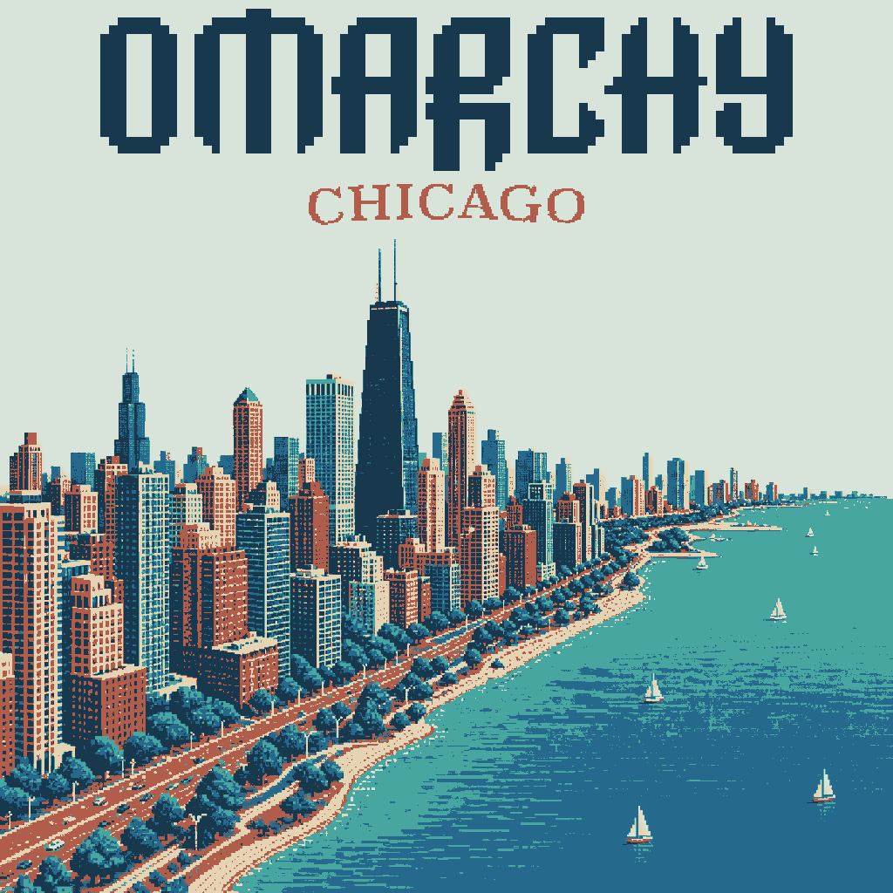
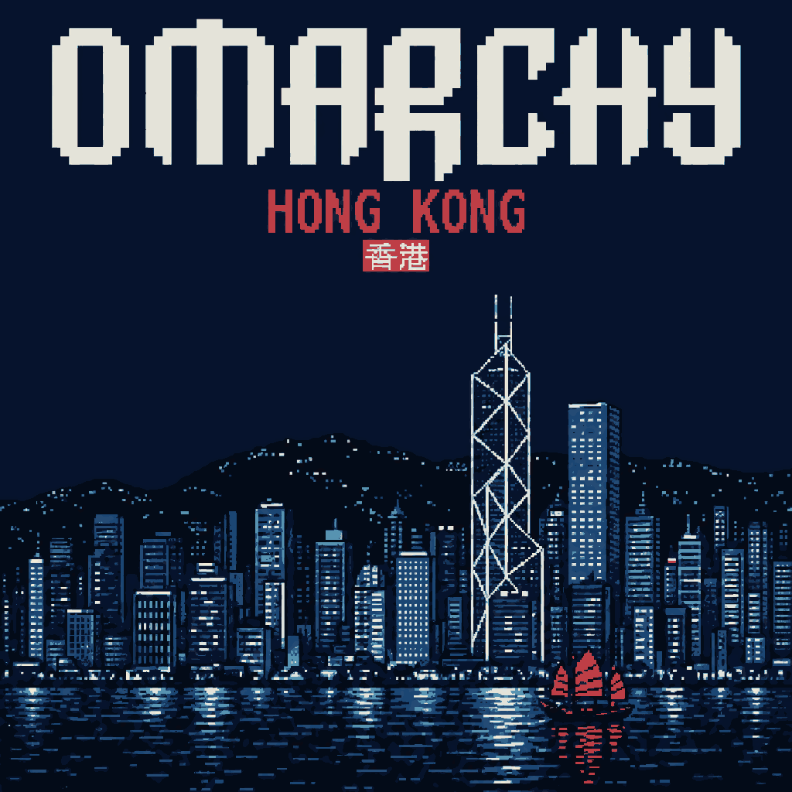
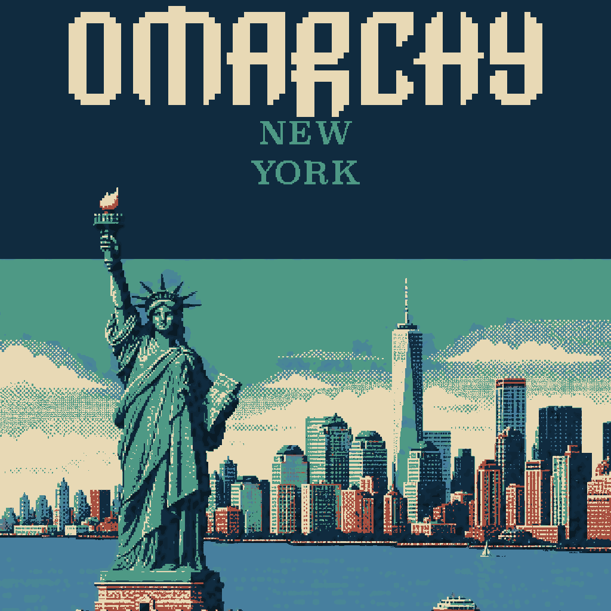
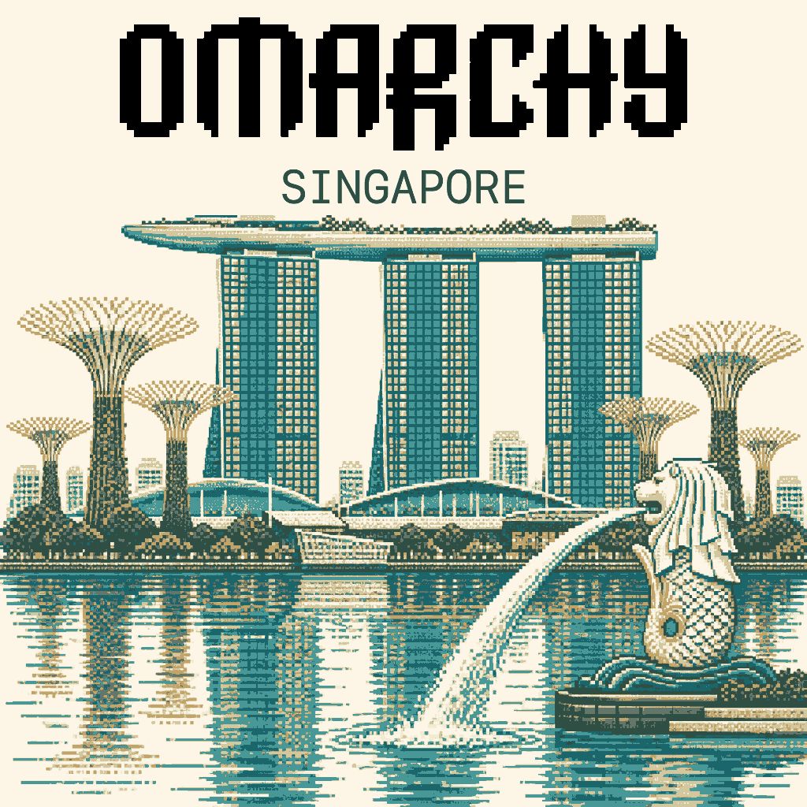

# Omarchy Style

An agent-ready design system for creating Omarchy interfaces, websites, themes, posters, illustrations, icons, product copy, menus, and keyboard-first interactions.

The repository translates the visual and interaction language of [Omarchy](https://omarchy.org/) into reusable guidance for AI coding and design agents. It is informed by the [official Omarchy repository](https://github.com/basecamp/omarchy), the [Omarchy Manual](https://omarchy.org/manual/), and community artwork.

## What it preserves

- The official sharp Omarchy wordmark and pixel/ASCII character
- JetBrains Mono and terminal-native information hierarchy
- Nerd Font and official `omarchy.ttf` icon-font glyphs as the interface icon language, and the community [Omarchy Font](https://github.com/markcuda/Omarchy-Font) for wordmark-style display lettering
- Keyboard-first interaction and discoverable shortcuts
- Strict grids, square geometry, thin borders, and restrained effects
- Semantic theme colors instead of a fixed “brand green”
- Direct, specific, technically honest product language
- Locally meaningful community artwork rather than generic cyberpunk imagery

## Install

Install the Skill from GitHub with the open Agent Skills CLI:

```bash
npx skills add huacnlee/omarchy-style --skill omarchy-style
```

Use `-g` for a global installation or `-a codex` to target Codex explicitly. Restart the agent session after installation so the Skill is discovered.

## Use

Invoke the Skill explicitly when designing or reviewing an Omarchy artifact:

```text
Use $omarchy-style to design an Omarchy settings panel for managing themes.
```

```text
Use $omarchy-style to create a text-free community wallpaper with a dark pixel-art city scene.
```

```text
Use $omarchy-style to review this menu, its keyboard navigation, and its shortcut labels.
```

The Skill routes each task to the relevant design-system sections and adds specialized illustration guidance for posters, city covers, and wallpapers.

## Repository structure

```text
skills/
└── omarchy-style/
    ├── SKILL.md                     # Agent entry point and routing rules
    ├── agents/openai.yaml           # Agent metadata
    └── references/
        ├── design-system.md          # Complete visual and interaction system
        ├── illustration-design.md    # Illustration and image-generation rules
        └── example-quality.md        # Finish and density benchmarks

assets/
├── logo.svg                          # Official wordmark asset
├── meetup/                           # Meetup design examples
└── references/                       # External visual references
```

## Design references

- [Complete design system](skills/omarchy-style/references/design-system.md)
- [Illustration design guide](skills/omarchy-style/references/illustration-design.md)
- [Example quality notes](skills/omarchy-style/references/example-quality.md)
- [Meetup examples](assets/meetup/)

## Example work

| Chicago | Hong Kong |
|---|---|
|  |  |

| New York | Singapore |
|---|---|
|  |  |

Examples demonstrate possible visual modes; they are references, not mandatory templates. Omarchy themes and community expression may vary as long as the stable brand and interaction principles remain intact.

## Attribution

Omarchy is created by Basecamp. This community design Skill is an independent project and links back to official assets and documentation wherever those sources are authoritative.

## License

[MIT](LICENSE)
